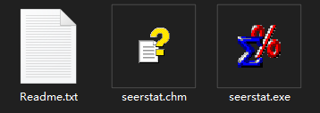
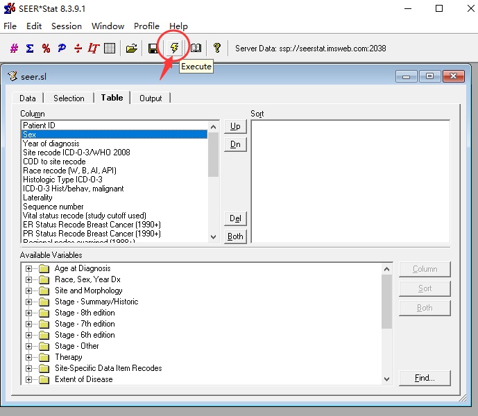

## ⭐SurvTRACE: Transformers for Survival Analysis with Competing Events

This repo provides the implementation of **SurvTRACE** for survival analysis.


### 🔥See the demo

Please refer to **experiment_metabric.ipynb** and **experiment_support.ipynb** !


### 🔥How to config the environment

Use our pre-saved conda environment!

```shell
conda env create --name survtrace --file=survtrace.yml
conda activate survtrace
```

or try to install from the requirement.txt

```shell
pip3 install -r requirements.txt
```

If pytorch cannot find CUDA, try un-installing and re-installing pytorch
```
conda remove pytorch torchvision torchaudio cudatoolkit
conda install pytorch torchvision torchaudio cudatoolkit=10.2 -c pytorch
```


### 🔥How to get SEER data

1. Go to https://seer.cancer.gov/data/ to ask for data request from SEER following the guide there.

2. After complete the step one, we should have the following **seerstat software** for data access. Open it and sign in with the username and password sent by seer.

  

3. Use seerstat to open the **./data/seer.sl** file, we shall see the following.

    

Click on the 'excute' icon to request from the seer database. We will obtain a csv file.

4. move the csv file to **./data/seer_raw.csv**, then run the python script **process_seer.py**, as

   ```shell
   python process_seer.py
   ```

   we will obtain the processed seer data named **seer_processed.csv**.


